### **인프런에 [이 강의](https://www.inflearn.com/course/%EC%8A%A4%ED%94%84%EB%A7%81-%EC%9E%85%EB%AC%B8-%EC%8A%A4%ED%94%84%EB%A7%81%EB%B6%80%ED%8A%B8)에서 학습하고 있습니다.**

# **1. 프로젝트 생성**
[spring initializr](https://start.spring.io)는 스프링에서 운영하는 사이트로 스프링 부트를 기반으로 스프링 프로젝트를 만들어준다.<br>
(아래는 spring initializr 사이트 화면이다.)
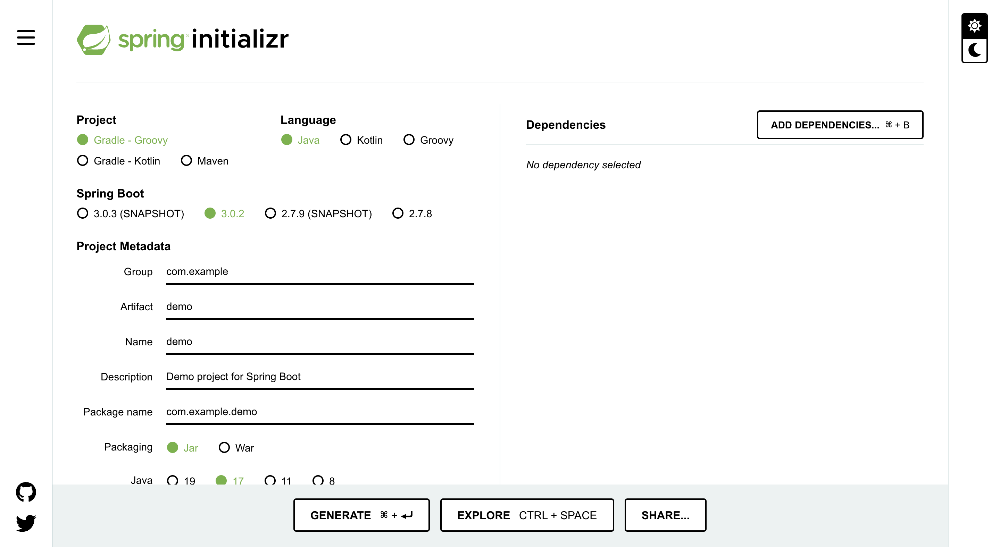

Project 란에 Maven / Gradle Project가 있다.<br>
요즘엔 Gradle Project를 주로 쓴다.

그 외에 버전, 메타 데이터를 설정한다.<br>
Dependencies에는 **Spring Web**과 **Thymeleaf 라이브러리**를 추가해준다.<br>
그리고 밑에 GENERATE 버튼을 클릭하면 zip 파일을 준다

압축을 풀고 intelliJ나 eclipse로 bundle.gradle을 열어주면 된다.<br>
열면 Dependencies로 설정한 라이브러리 등등을 다운 받아준다.

폴더 구조는 이렇게 생겼다.<br>
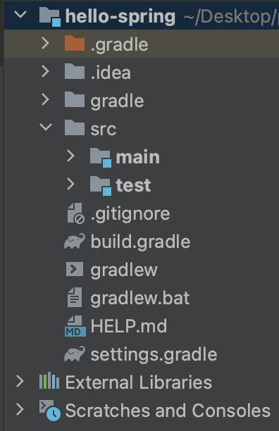

src폴더에 build.gradle을 보면 설정했던 내용들이 들어있다.

src폴더에 main/java폴더에 들어가면 spring initializr 사이트에서 입력했던 메타 데이터 이름으로 폴더와 .java 파일이 있다.<br>
.java 파일에 public 클래스에 main 메서드를 실행하면 프로젝트를 실행할 수 있다.
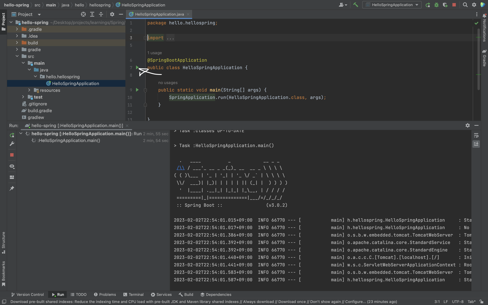

# **2. 라이브러리 살펴보기**
Gradle은 라이브러리를 설치할 때 의존 관계가 있는 라이브러리를 할께 다운로드 한다.

**스프링 부트 라이브러리**

- spring-boot-starter-web 라이브러리에는 대표적으로
    - spring-boot-starter-tomcat (톰캣 웹서버)와
    - spring-webmvc: 스프링 웹 MVC 라이브러리가 들어있다.
- spring-boot-starter-thymeleaf는 html을 렌더링해주는 템플릿 엔진이다.
- spring-boot-starter (공통적으로 들어있음)에는
    - spring-boot와
        - spring-core 등 스프링 관련 라이브러리가 들어있고
    - spring-boot-starter-logging에
        - logback(구현체), slf4j(인터페이스)가 들어있다.

**테스트 라이브러리**
- spring-boot-starter-test 라이브러리에는
    - junit (테스트 프레임워크)
    - mockito (mock 라이브러리)
    - assertj (테스트 코드 편하게 작성하게 도와주는 라이브러리)
    - spring-test (스프링 통합 테스트)가 들어있다.

# **3. View 환경설정**
src/main/resources/static 폴더에 index.html 파일을 만들고,<br>
위에서 말한 .java 파일을 실행하면 '/'경로로 index.html 파일이 렌더링된다.

서버와 브라우저가 데이터를 주고 받으려면 다음처럼 하면 된다.<br>
src/main/java/(만들어진폴더) 에 controller 패키지를 만들고, controller 클래스를 만든다.<br>

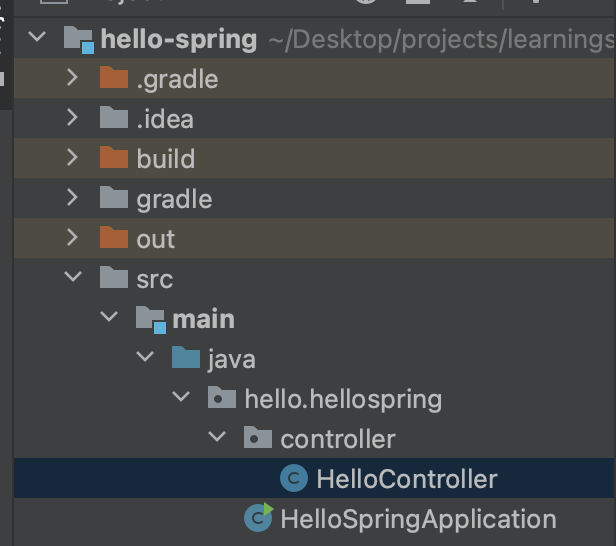


사진에 HelloController 클래스는 다음처럼 쓰고

```java
package hello.hellospring.controller;

import org.springframework.stereotype.Controller;
import org.springframework.ui.Model;
import org.springframework.web.bind.annotation.GetMapping;

@Controller
public class HelloController {

    @GetMapping("hello")
    public String hello(Model model) {
        model.addAttribute("data", "hello!!");
        return "hello";
    }
}

```

src/main/resources/templates/ 폴더에 hello.html을 만들고 다음처럼 적으면 된다.

```html
<!DOCTYPE html>
<html xmlns:th="http://www.thymeleaf.org">
<head>
    <meta charset="UTF-8">
    <title>Hello</title>
</head>
<body>
<p th:text="'안녕하세요.' + ${data}" >안녕하세요. 손님</p>
</body>
</html>
```

HelloController 클래스에 `@GetMapping("hello")`는 주소에 /hello 경로를 의미하고 `Model model`은 스프링에서 주는 모델을 받는다.<br>
`model.addAttribute("data", "hello!!");`는 `data`라는 키에 `hello!!`라는 값을 할당한거고<br>
`return "hello";`는 templates 폴더에 hello.html을 렌더링하라는 의미이다.

hello.html에 html태그에 xmlns:th는 thymeleaf 템플릿 엔진을 선언하는 코드고<br>
p태그에 th:text에 ${data}는 위에 HelloController에 `model.addAttribute("data", "hello!!");` 에 `data` 키에 해당하는 값, `hello!!`를 의미한다.

프로젝트를 실행하고 /hello 경로로 이동해보면

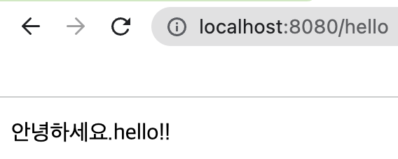

hello.html에 p태그에 th:text 속성이 p태그로 감싸져 나오는 것을 확인해볼 수 있다.

# **4. 빌드하고 실행하기**

터미널을 열고 spring initialzr에서 다운받고 코드를 짰던 폴더로 이동한다.<br>
mac은 `./gradlew build`, windows는 `./gradlew.bat build`를 입력하면 build 폴더가 만들어진다.

build/libs/ 폴더로 이동하고 ~~~~SNAPSHOT.jar 파일이 있는지 확인한 후
```
java -jar ~~~~~SNAPSHOT.jar
```
을 입력하면 스프링부트가 실행된다.

build 폴더를 삭제할 때는 gradlew, gradlew.bat이 있는 폴더에서 `./gradlew clean` 또는 `./gradlew.bat clean`을 입력하면 된다.

# **5. 웹 개발**
웹 개발에는 크게 3가지로
- 정적 컨텐츠
- MVC와 템플릿 엔진
- API

가 있다.

정적 컨텐츠 방식은 서버에서 하는 것 없이 클라이언트한테 그대로 보내주는 것이고<br>
MVC와 템플릿 엔진 방식은 JSP, PHP 같은 템플릿 엔진으로 서버에서 동적으로 바꿔서 클라이언트한테 보내주는 방식이다.<br>
API는 데이터를 제공받기 위한 규격을 의미하는데 데이터 구조 포맷으로 데이터를 클라이언트한테 보내주는 방식이다.

## **5-1. 정적 컨텐츠**

Spring Boot에서 src/main/resources/static/ 폴더에서 정적 컨텐츠를 생성할 수 있다.<br>
만약 `hello-static.html`을 만들고 프로젝트를 실행한 뒤, /hello-static.html 주소를 입력하면 `hello-static.html` 파일이 보인다.

Spring Boot에서 정적 컨텐츠가 보이는 방식은 이렇다.

1. 내장 톰캣 서버가 요청을 받고 스프링한테 넘긴다.
2. 스프링이 먼저 컨트롤러 쪽에 `hello-static.html`이 있는지 찾는다. (컨트롤러가 우선순위를 가짐)
3. `hello-static.html`로 맵핑이 된 컨트롤러가 없으니 resources/static/ 폴더에 hello-static.html을 찾는다.
4. 있으니 클라이언트 쪽으로 보내준다.

## **5-2. MVC와 템플릿 엔진**

MVC: Model, View, Controller

과거에는 Controller와 View라는게 따로 분리되어 있지 않았고 View에 모든 걸 다했다. JSP가 그렇다.<br>
이 방식을 모델1 방식이라고 한다.

url에 파라미터를 받아오는 방식은 다음처럼 하면 된다.

먼저 위에서 만들었던 HelloController 클래스에 `hello-mvc`를 Get으로 맵핑해준다.
```java
@GetMapping("hello-mvc")
public String helloMvc(@RequestParam("name") String name, Model model) {
    model.addAttribute("name", name);
    return "hello-template";
}
```
helloMvc 메소드에 `@RequestParam("name") String name` 파라미터가 있는데 url에 name이라는 키의 값은 이 파라미터가 받아온다.<br>
그 값을 model에 name이라는 키로 할당하고 hello-template이라는 파일을 렌더링해준다.

hello-template이라는 파일이 있어야 렌더링 되므로 resources/templates/ 폴더에 `hello-template.html` 파일을 만들어준다.

```html
<!DOCTYPE html>
<html xmlns:th="http://www.thymeleaf.org">
<head>
    <meta charset="UTF-8">
    <title>Hello</title>
</head>
<body>
<p th:text="'hello. ' + ${name}" >hello!. empty</p>
</body>
</html>
```

이제 Spring Boot를 실행하고 name파라미터와 함께 주소를 입력하면

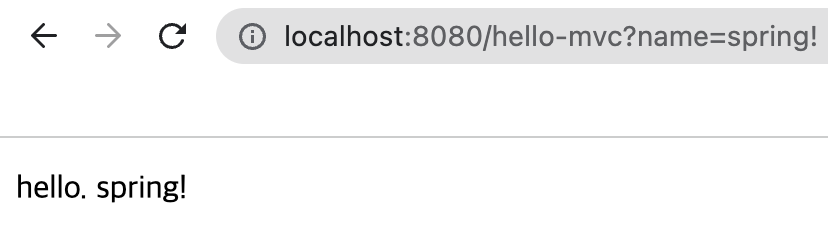

name 파라미터 값이 ${name}에 잘 들어간 것을 확인할 수 있다.

Spring Boot에서 MVC와 템플릿 엔진 처리 방식은 이렇다.

1. 내장 톰캣 서버가 요청을 받고 스프링한테 넘긴다.
2. 스프링은 컨트롤러를 살펴보는데 해당 주소가 맵핑 되어 있는 메소드가 있으니 실행한다.
3. model에 name이라는 키로 값을 할당해주고 hello-template를 스프링한테 보내준다.
4. 스프링이 viewResolver를 동작시킨다. viewResolver는 뷰를 찾아주고 템플릿 엔진을 연결시켜주는 역할이다.
5. viewResolver는 templates/ 에 html 파일을 찾고 템플릿 엔진한테 넘긴다.
6. 템플릿은 렌더링을 해서 변환된 파일을 클라이언트한테 보내준다.

정적 컨텐츠는 6단계에 변환하는 단계가 없다.

## **5-3. API**

API는 데이터만 보내주기에 다음 처럼 메소드를 짜면 된다.
```java
@GetMapping("hello-string")
@ResponseBody
public String helloString(@RequestParam("name") String name) {
    return "hello " + name;
}
```

여기서 @ResponseBody는 메소드가 return하는 값이 뷰 파일 이름이 아닌 http에 Body부에 들어가는 값을 의미한다.

Spring Boot를 실행하고 name 파라미터와 함께 /hello-string 주소를 입력하면
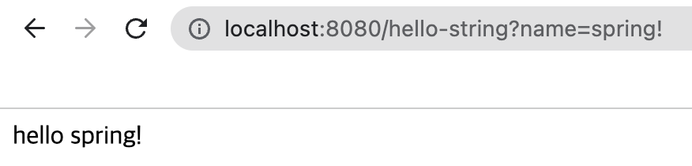

문자열이 잘나오는 것을 볼 수 있고 우클릭, 페이지 검사를 눌러보면
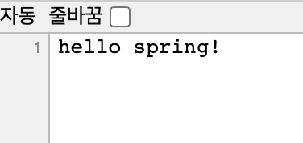

진짜로 문자열만 있는 것을 확인할 수 있다.

JSON을 보내줄 땐 자바에 객체를 보내주면 되는데<br>
아래 메소드를 추가로 입력해준다.

```java
@GetMapping("hello-api")
@ResponseBody
public Hello helloApi(@RequestParam("name") String name) {
    Hello hello = new Hello();
    hello.setName(name);
    return hello;
}

static class Hello {
    private String name;

    public String getName() {
        return name;
    }

    public void setName(String name) {
        this.name = name;
    }
}
```

helloApi 메소드는 Hello라는 객체를 반환하는데 얘도 마찬가지로 name 파라미터와 함께 /hello-api 주소로 이동하면
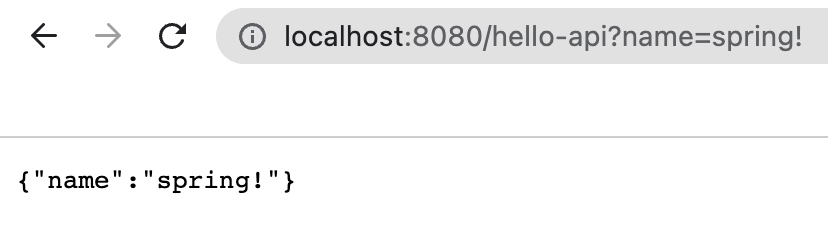

잘 받아와지는 것을 볼 수 있다.

Spring Boot에서 API 동작 방식은 이렇다.

1. 내장 톰캣 서버가 요청을 받고 스프링한테 넘긴다.
2. 스프링은 컨트롤러를 살펴보는데 해당 주소가 맵핑 되어 있는 메소드가 있으니 실행한다.
3. 그런데 ResponseBody라는 어노테이션이 붙어있으니 스프링은 viewResolver는 동작하지 않고 httpMessageConverter가 동작한다.
4. 만약 메소드에 return 값이 단순 문자라면 StringConverter가 동작하고 객체면 JsonConverter가 기본으로 동작한다.
5. 요청한 클라이언트한테 보내준다.

기본 문자처리는 StringHttpMessageConverter가 하고<br>
기본 객체처리는 MappingJackson2HttpMessageConverter가 한다.<br>
(Jackson은 객체를 JSON으로 바꿔주는 라이브러리다.)

# **6. 회원관리 백엔드 개발**

## **6-1. 비즈니스 요구사항 정리**

- 데이터: 회원ID, 이름
- 기능: 회원 등록, 조회
- 아직 데이터 저장소가 선정되지 않음 (스프링 특성을 잘보기 위해 이렇게 정함)

**"일반적인 웹 어플리케이션 계층 구조"**

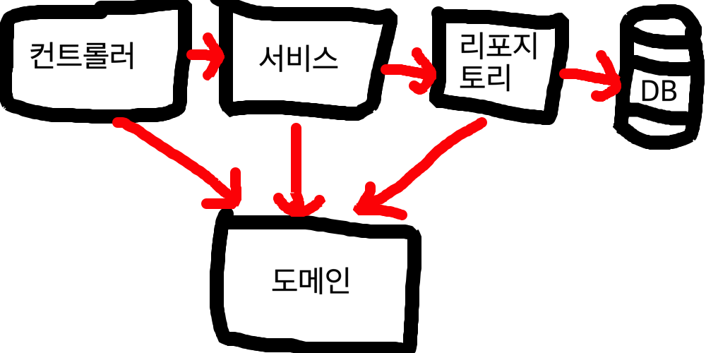

- 컨트롤러: MVC에 컨트롤러이다.
- 도메인: 비즈니스 도메인 객체로, 회원, 쿠폰 등 DB에 저장되고 관리되는 도메인 객체이다.
- 서비스: '회원은 중복가입이 안된다.'등, 비즈니스 도메인 객체를 활용하여 핵심 로직들이 동적하도록 한 객체이다.
- 리포지토리: DB에 접근을 하며, 도메인 객체를 저장하고 관리한다.

**"클래스 의존관계"**

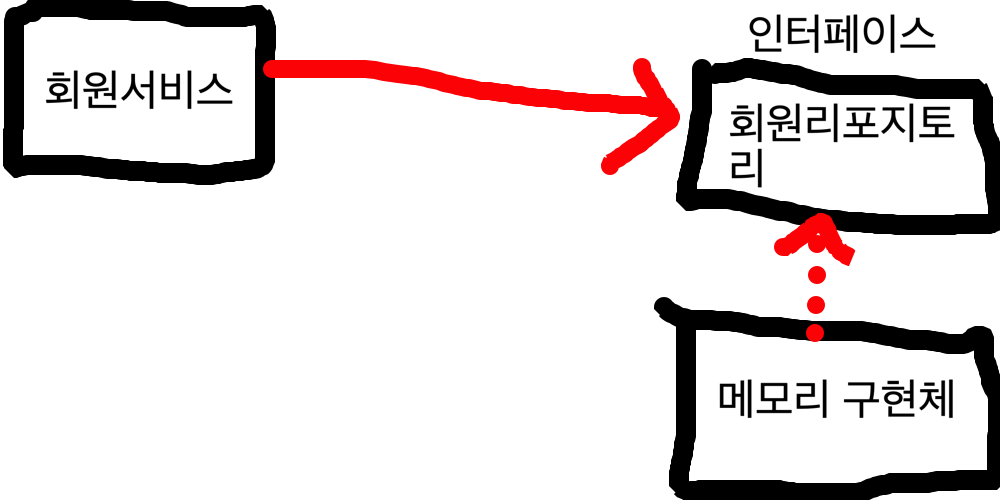

메모리 구현체는 개발을 해야하는 상황에서 DB가 정해지지 않았을 때 메모리를 DB대신 사용하는 것이다. <br>
나중에 DB로 교체하기 위해 인터페이스가 필요하다.

먼저 회원서비스를 구현하기 위해 src/main/java/(만들어진폴더)/ 에 domain 패키지를 만들고 그 안에 Memeber 클래스를 만든다. 그리고 Member 클래스는 다음처럼 코드를 짠다.

```java
public class Member {

    private Long id;
    private String name;

    public Long getId() {
        return id;
    }

    public void setId(Long id) {
        this.id = id;
    }

    public String getName() {
        return name;
    }

    public void setName(String name) {
        this.name = name;
    }
}

```
얘는 Member라는 DB에 관리되는 객체이므로 도메인 패키지에 저장하는 것이다.

회원리포지토리(인터페이스)는 src/main/java/(만들어진폴더)/ 에 repository 패키지를 만들고 MemberRepository 인터페이스를 만든다. 인터페이스 코드는 다움처럼 짠다.

```java
package hello.hellospring.repository;

import hello.hellospring.domain.Member;

import java.util.List;
import java.util.Optional;

public interface MemberRepository {
    Member save(Member member);
    Optional<Member> findById(Long id);
    Optional<Member> findByName(String name);
    List<Member> findAll();
}
```
Optional은 Null 값으로 인해 생기는 예외를 피하기 위해 사용한다.
Optional에 감싸진 값이 Null이더라도 예외가 발생하지 않는다.

메모리 구현체를 만들기 위해 만들었던 repository 패키지 않에 MemoryMemberRepository 클래스를 만든다. 코드는 다음처럼 짠다.

```java
public class MemoryMemberRepository implements MemberRepository {

    private static Map<Long, Member> store = new HashMap<>();
    private static long sequence = 0L;

    @Override
    public Member save(Member member) {
        member.setId(++sequence);
        store.put(member.getId(), member);
        return member;
    }

    @Override
    public Optional<Member> findById(Long id) {
        return Optional.ofNullable(store.get(id));
    }

    @Override
    public Optional<Member> findByName(String name) {
        return store.values().stream().filter(member -> member.getName().equals(name)).findAny();
    }

    @Override
    public List<Member> findAll() {
        return new ArrayList<>(store.values());
    }
    
    public void clearStore() {
        store.clear();
    }
}
```

`store.clear()`는 store를 비우는 구문이다.

## **6-2. 회원 리포지토리 테스트 케이스 작성**

테스트 케이스는 src/test/java/(만들어진폴더)/ 에 패키지, 클래스를 만들어서 할 수 있다.

repository 패키지를 만들고 안에 MemoryMemberRepositoryTest 클래스를 만든다.
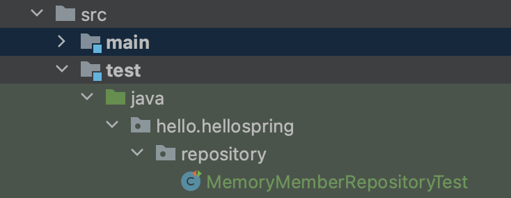

MemoryMemberRepository에 대한 테스트케이스를 작성할 때<br>
그 클래스의 이름은 테스트를 하려는 클래스 이름 옆에 Test라는 글자를 붙여 짓는 것이 관례이다.

클래스는 다음처럼 적는다.

```java
package hello.hellospring.repository;

import hello.hellospring.domain.Member;
import org.junit.jupiter.api.AfterEach;
import org.junit.jupiter.api.Test;

import java.util.List;
import java.util.Optional;

import static org.assertj.core.api.Assertions.*;
import static org.junit.jupiter.api.Assertions.*;

class MemoryMemberRepositoryTest {
    MemoryMemberRepository repository = new MemoryMemberRepository();

    @AfterEach
    public void afterEach() {
        repository.clearStore();
    }

    @Test
    public void save() {
        Member member = new Member();
        member.setName("spring");

        repository.save(member);

        Member result = repository.findById(member.getId()).get();
        assertEquals(member, result);
        assertThat(result).isEqualTo(member);
    }

    @Test
    public void findByName() {
        Member member1 = new Member();
        member1.setName("spring1");
        repository.save(member1);

        Member member2 = new Member();
        member2.setName("spring2");
        repository.save(member2);

        Member result = repository.findByName("spring2").get();
        assertThat(result).isEqualTo(member2);
    }

    @Test
    public void findAll() {
        Member member1 = new Member();
        member1.setName("spring1");
        repository.save(member1);

        Member member2 = new Member();
        member2.setName("spring2");
        repository.save(member2);

        List<Member> result = repository.findAll();

        assertThat(result.size()).isEqualTo(2);
    }
}
```

여기서 assertEquals는 `org.junit.jupiter.api.Assertions.*`에 있는 메소드이고<br>
assertThat은 `org.junit.jupiter.api.Assertions.*`에 있는 메소드이다.

이 두개로 테스트한 메소드의 반환값과 Member 객체가 같은지 확인할 수가 있다.

그리고 테스트를 수행하는 메소드는 @Test라는 어노테이션을 달고 있어야한다.

@AfterEach 어노테이션은 테스트가 하나 끝날 때마다 메소드를 실행할 때 쓴다.

@AfterEach에 메소드에 repository 객체에 store 객체를 clear하는 구문이 있는데<br>
findByName과 findAll 메소드가 테스트하는 Member 객체들의 이름이 서로 같은게 존재하기 때문이다.

클래스 이름 옆에 실행 버튼을 눌러 모든 테스트 케이스들을 실행할 수 있다.

## **6-3. 회원 서비스 개발**

[6-1](#6-1-비즈니스-요구사항-정리)에 웹 어플리케이션 계층 구조를 살펴보면 마지막으로 서비스를 만들어야하는게 보인다.<br>1
서비스는 리포지토리와 비슷하게 DB에 데이터를 다루는 건 똑같다.<br>
하지만 리포지토리는 DB에 데이터를 생성, 수정, 삭제, 조회같은 직접적으로 DB에 데이터를 다룬다면<br>
서비스는 기획자나 다른 협업하는 사람도 알 수 있는 메소드 이름으로 리포지토리보다 더 비즈니스 적인 로직을 사용한다.

서비스도 리포지토리, 도메인 패키지와 같은 폴더 위치인 src/main/java/(만들어진폴더)/ 에 service라는 패키지를 만들고 MemberService라는 클래스를 만든다.

MemberService 클래스 코드는 다음처럼 짜면 된다.

```java
public class MemberService {
    private final MemberRepository memberRepository = new MemoryMemberRepository();

    /**
     * 회원 가입
     */
    public Long join(Member member) {
        // 같은 이름이 있는 중복 회원 X
        validateDuplicateMember(member); // 중복 회원 검증

        memberRepository.save(member);
        return member.getId();
    }

    private void validateDuplicateMember(Member member) {
        memberRepository.findByName(member.getName())
                .ifPresent(m -> { // null이 아닌 어떤 값이 있으면
            throw new IllegalStateException("이미 존재하는 회원입니다.");
        });
    }

    /**
     * 전체 회원 조회
     */
    public List<Member> findMembers() {
        return memberRepository.findAll();
    }

    public Optional<Member> findOne(Long memberId){
        return memberRepository.findById(memberId);
    }
}
```

join 메소드는 validateDuplicateMember 메소드를 통해 먼저 중복되는 이름이 있는지 확인한다.

validateDuplicateMember 메소드에 .ifPresent는 Optional에 붙는 메소드인데<br>
만약 Optional에 감싸진 값이 null이 아닌 값이라면 인자에 람다를 실행한다.

여기서 이름이 중복되는 멤버가 있는지 확인하고 만약 있다면 IllegalState 예외를 던진다.<br>
만약 중복되는 멤버가 없다면 memberrepository에 멤버를 저장하고 ID를 반환한다.

findMembers는 memberRepository에 모든 멤버를 반환하고<br>
findOne은 memberId로 멤버 한명을 찾는다.

## **6-4. 회원 서비스 개발**

MemoryMemberRepository 클래스처럼 MemberService 클래도 test 폴더에 테스트하는 클래스를 만들어주면 되는데 테스트하고자 하는 클래스에 ⌘ ⇧ T 를 입력하면 test 폴더에 테스트 케이스 구조를 바로 만들 수 있다.

추가로 프로덕션 코드에 메소드는 영어로 써야하지만 테스트 케이스에 메소드는 한글로 써도 상관이 없다.<br>
테스트 코드이기 때문에 빌드할 때 포함이 안되기도 하고 좀 더 직관적일 수 있기 때문이다.<br>
실제로도 협업할 때 한글로 많이 쓰기도 한다고 한다.

테스트 케이스 코드는 다음과 같다.
```java
class MemberServiceTest {
    MemberService memberService;
    MemoryMemberRepository memberRepository;

    @BeforeEach
    public void beforeEach() {
        memberRepository = new MemoryMemberRepository();
        memberService = new MemberService(memberRepository);
    }

    @AfterEach
    public void afterEach() {
        memberRepository.clearStore();
    }

    @Test
    void 회원가입() {
        /* 만약 테스트 코드가 매우 길땐 아래 패턴으로 짜면 알기 쉽다. */

        // given: 무언가 데이터가 주어졌고
        Member member = new Member();
        member.setName("spring");

        // when: 이걸로 실행했는데
        Long saveId = memberService.join(member);

        // then: 결과가 이게 나와야 해
        Member findMember = memberService.findOne(saveId).get();
        assertThat(findMember.getName()).isEqualTo(member.getName());
    }

    @Test
    public void 중복_회원_예외() {
        // given
        Member member1 = new Member();
        member1.setName("spring");

        Member member2 = new Member();
        member2.setName("spring");
        
        // when
        memberService.join(member1);

        // then
        IllegalStateException e = assertThrows(IllegalStateException.class, () -> memberService.join(member2));
        assertThat(e.getMessage()).isEqualTo("이미 존재하는 회원입니다.");
    }

    @Test
    void findMembers() {
    }

    @Test
    void findOne() {
    }
}
```
여기서 @BeforeEach는 @AfterEach와 반대로 각각의 테스트 케이스 메소드가 실행되기 전에 메소드를 실행시키는 어노테이션이다.<br>
@BeforeEach에 메소드를 보면 MemberService에 MemoryMemberRepository 객체를 넘기고 있는데 이에 따라 MemberService도 코드를 조금 수정해야한다,

MemberService에 MemberRepository 객체를 선언했던 코드를 다음처럼 변경한다.
```java
private final MemberRepository memberRepository;

public MemberService(MemberRepository memberRepository) {
    this.memberRepository = memberRepository;
}
```
MemberService 생성자가 외부에서 객체를 받고 그 객체를 MemberRepository의 객체인 memberRepository에 대입하고 있다.<br>
이런 방식을 DI(Dependency Injection)이라고 부흔다.

다시 MemberServiceTest 클래스로 돌아와서 각각의 테스트 케이스 메소드들을 살펴보면<br>
given, when, then이라는 주석이 보이는데 테스트 케이스를 작성할 때 이 주석과 함께 이런식으로 작성하고 다른 사람이 코드를 봤을 때 이해하기도 쉽고 좀 더 깔금해진다.<br>
의미는 주석에 나와있는대로다.

중복_회원_예외 메소드는 중복된 이름의 회원이 가입을 했을 때 IllegalStateException 에러가 나오는지 테스트하는 메소드다.

이 때 JUnit에 assertThrows를 쓰면 에러 테스트를 좀 더 수월하게 할 수 있다.<br>
첫번째 인자로 기대하는 에러, 두번째 인자로 에러가 나오는 실행문을 람다로 작성한다.<br>
코드에서 보이듯이 에러 객체를 반환하고 에러 메세지도 assertThat 구문을 통해 테스트하는 것을 볼 수 있다.

# **7. 스프링 빈과 의존관계**
## **7-1. 컴포넌트 스캔과 자동 의존관계 설정**

본격적으로 테스트가 끝났으니 위에서 만든 Member라는 도메인 객체와 MemberService, MemoryMemberRepository를 사용해볼 차례다.<br>
그전에 [6-1](#6-1-비즈니스-요구사항-정리)에서 보이듯이 마지막으로 컨트롤러를 만들어야한다.

기존에 만들었던 HelloController 클래스와 비슷하게 controller/ 폴더에 MemberController 클래스를 작성한다.<br>
```java
@Controller
public class MemberController {
    private final MemberService memberService;

    @Autowired
    public MemberController(MemberService memberService) {
        this.memberService = memberService;
    }
}
```
@Autowired라는 어노테이션이 보이는데 이 클래스 입장에서 @Autowired는<br>
스프링이 MemberController 클래스를 생성할 때 MemberController 생성자를 실행하고 인자에 객체는 **스프링 컨테이너에서에서 관리하는 객체를** 가지고 오는 역할이다.

이 말은 위에서 만들었던 서비스 클래스를 스프링 컨테이너가 관리하게 해줘야 한다는 말인데<br>
그러기 위해선 서비스 클래스도 컨트롤러와 비슷하게 클래스 위에 @Service라는 어노테이션을 달아줘야한다.
```java
// MemberService 클래스
@Service
public class MemberService {
    ...
}
```
이때 컨트롤러나 서비스 등의 어노테이션을 이용하여 스프링 컨테이너가 관리하게 만드는 방식을 **'컴포넌트 스캔'** 방식이라고 하고, 스프링 컨테이너가 관리하는 이런 자바 객체들을 **'스프링 빈'** 이라고 한다.

서비스에서 리포지토리 객체를 가지고오는 메서드도 아래처럼 수정하고
```java
@Service
public class MemberService {
    ...
    @Autowired
    public MemberService(MemberRepository memberRepository) {
        this.memberRepository = memberRepository;
    }
    ...
}
```
위에서 만들었던 리포지토리 클래스도 아래처럼 수정한다.
```java
// MemoryMemberRepository 클래스
@Repository
public class MemoryMemberRepository implements MemberRepository {
    ...
}
```

스프링 빈을 등록하는 방법에는 2가지가 있다.
그 첫번째가 위에서 했던 컴포넌트 스캔과 자동 의존관계 설정 방식이다.

이 방식은 @Component 어노테이션을 이용하여 스프링 빈을 만드는 방식이다.<br>
@Controller, @Service, @Repository도 해당 파일에 들어가보면 @Component 어노테이션이 붙어있다.

컴포넌트 스캔의 대상은 src/main/java/(만들어진 폴더)/ 바로 안래 애플리케이션 클래스가 있는 패키지 내부까지다.<br>
때문에 main/java/ 폴더에 어떤 패키지와 클래스를 만들고 컴포넌트 스캔으로 스프링 빈을 만들려고 해도 만들어지지 않는다.

그리고 스프링은 기본으로 스프링 빈을 싱글톤으로 등록한다.<br>
즉, 유일하게 하나의 인스턴스만 등록하고, 이 인스턴스 하나를 공유한다.<br>
싱글톤이 아니게 설정할 수 있지만 보통 싱글톤으로 사용한다.

## **7-2. 자바 코드로 직접 스프링 빈 등록하기**


자바 코드로 직접 스프링 빈을 등록하기 위해서 먼저 컴포넌트 스캔 방식을 지워야한다.

MemberService와 MemoryMemberRepository 클래스에서 클래스명 위엥 @Service, @Repository 어노테이션을 지우고, MemberService에 @Autowired를 지운다.

src/main/java/(만들어진 폴더)/ 에 SpringConfig 라는 클래스를 하나 만들고<br>
아래처럼 코드를 짠다.
```java
@Configuration
public class SpringConfig {

    @Bean
    public MemberService memberService() {
        return new MemberService(memberRepository());
    }

    @Bean
    public MemberRepository memberRepository() {
        return new MemoryMemberRepository();
    }
}
```
`@Configuration`을 단 클래스는 빈 설정을 담당하는 클래스가 된다.<br>
그리고 `@Bean`을 단 메소드는 스프링이 호출해서 스프링 빈에 등록해준다.

MemberService 객체를 반환하는 메소드에 MemberSerice 생성자는 인자로 MemberRepository 객체를 하나 받기 때문에<br>
memberRepository 메소드를 안에서 호출해 객체를 받는다.

위에서 DI 방식을 보았는데 이 DI에는 3가지 방법이 있다.
- 필드 주입(Field Injection)
    ```java
    // MemberController
    @Controller
    public class MemberController {

        @Autowired
        private MemberService memberService;
    }
    ```
    필드에 바로 @Autowired 어노테이션을 다는 방식이다.<br>
    필드 주입 방식은 스프링 컨테이너 외에 외부에서 주입할 수 있는 방법도 없고 final로 선언할 수도 없기에 좋은 방법은 아니다.
- setter 주입
    ```java
    public class MemberController {

        private MemberService memberService;

        @Autowired
        public void setMemberService(MemberService memberService) {
            this.memberService = memberService;
        }
    }
    ```
    생성자가 생성된 후 @Autowired에 의해 호출 되어 주입되는 방식이다.<br>
    단점은 memberService를 세팅하는 메소드에 public이 붙어있어야 해서<br>
    한번만 호출돼도 되는 메서드가 굳이 노출된다는 것이다.
- 생성자 주입
    ```java
    // MemberController
    @Controller
    public class MemberController {
        private final MemberService memberService;

        @Autowired
        public MemberController(MemberService memberService) {
            this.memberService = memberService;
        }
    }
    ```
    기존에 위에서 했던 방식이다.<br>
    생성자 위에 @Autuwired 어노테이션을 달아서 객체를 주입하는 방식이다.<br>
    이 방법을 쓰는걸 권장한다.

주로 정형화된 컨트롤러, 서비스, 리포지토리는 컴포넌트 스캔, 정형화되지 않거나, 상황에 따라 구현 클래스를 변경해야할 땐 설정을 통해 스프링 빈으로 등록한다.

위에서 임시로 만든 MemoryMemberRepository를 교체할 때 설정을 통해 스프링 빈으로 등록한다면 코드에 손 안되고 교체할 수 있다.

그리고 @Autowired는 스프링 컨테이너가 관리하는 객체에서만 동작한다.
```java
// MemberController

public class MemberController {
    private final MemberService memberService;

    @Autowired
    public MemberController(MemberService memberService) {
        this.memberService = memberService;
    }
}
```
이 클래스 같은 경우, 컴포넌트 스캔이나 따로 설정으로 스프링 빈으로 등록하지도 않았기에 @Autowired는 무용지물이 된다.

# **8. 회원 관리 예제, 웹 MVC 개발**

## **8-1. 회원 등록**
회원 가입 기능을 만들기 위해 MemberController 클래스에
```java
// MemberController
@GetMapping("/members/new")
public String createForm() {
    return "members/createMemberForm";
}

@PostMapping("/members/new")
public String create(MemberForm form) {
    Member member = new Member();
    member.setName(form.getName());

    memberService.join(member);

    return "redirect:/";
}
```
코드를 추가하고 resources/templates/ 아래에 members 폴더와 createMemberForm html파일을 만들었다.<br>
createMemberForm.html 파일은 다음처럼 생겼다.
```html
<!DOCTYPE html>
<html lang="en">
<head>
    <meta charset="UTF-8">
    <title>Create Member Form</title>
</head>
<body>
  <div class="container">
    <form action="/members/new" method="post">
      <div class="form-group">
        <label for="name">이름</label>
        <input type="text" id="name" name="name" placeholder="이름을 입력하세요">
      </div>
      <button type="submit">등록</button>
    </form>
  </div>
</body>
</html>
```
form 태그를 보면 action이 /members/new에 메소드가 post방식인 것을 볼 수 있고 input 태그에 name 속성의 값이 name인 것을 볼 수 있다.

MemberController에 보이는 @PostMapping은 Post 방식의 맵핑으로 Get과 반대로 클라이언트에서 데이터를 받을 때 사용한다.<br>
@PostMapping에 붙은 메소드는 MemberForm 객체를 받는데<br>
MemberForm 클래스는
```java
package hello.hellospring.controller;

public class MemberForm {
    private String name;

    public String getName() {
        return name;
    }

    public void setName(String name) {
        this.name = name;
    }
}
```
프로젝트를 실행하고 /members/new 주소로 이동하면
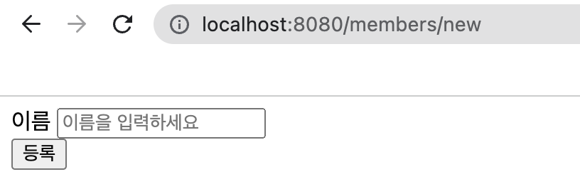
createMemberForm.html 파일이 렌더링되는데 이름을 입력하고 등록버튼을 누르면<br>
/members/new로 post 요청이 가게 되고<br>
@PostMapping("/members/new")를 단 메소드에 인자인 MemberForm에 setName 메소드를 스프링이 호출해서 String name 필드에 name속성의 값이 name이었던 input 태그의 값을 넣게 된다.

때문에 MemberController 클래스에서 @PostMapping을 단 create메소드를 보면<br>
Member객체에 이름을 form에 name 필드의 값으로 설정하는 것을 볼 수 있다.

실제로 출력해보면 잘 나옴

이게 뭐 때문에 input에 name 속성 값을 가지고 MemberForm에 setter 메소드를 호출하는지 확인을 해보니 name값을 setter 메소드 명에 포함하고 있어야 감지한다는 것을 확인했다.<br>
만약 input에 name값이 name1이라면 MemberForm에 setter 메소드명은 setName1 또는 setname1이 되야 한다는 것이다.

## **8-2. 회원 조회**
회원 조회는 Get 요청만 하면 되기에 MemberController 클래스에서
```java
@GetMapping("/members")
public String list(Model model) {
    List<Member> members = memberService.findMembers();
    model.addAttribute("members", members);
    return "members/memberList";
}
```
@GetMapping만 추가해주면 된다.<br>
조회할 때 모든 멤버 리스트를 조회하므로 memberService.findMembers()로 멤버 리스트를 받고 model에 members라는 키로 Member 리스트인 members를 값으로 할당해준다.

members/memberList를 반환하므로 members/ 폴더에 memberList.html 파일을 살펴보면
```html
<!DOCTYPE html>
<html lang="en" xmlns:th="https://www.thymeleaf.org">
<head>
    <meta charset="UTF-8">
    <title>Member List</title>
</head>
<body>
<div class="container">
  <div>
    <table>
      <thead>
        <tr>
          <th>#</th>
          <th>이름</th>
        </tr>
      </thead>
      <tbody>
      <tr th:each="member : ${members}">
        <td th:text="${member.id}"></td>
        <td th:text="${member.name}"></td>
      </tr>
      </tbody>
    </table>
  </div>
</div>
</body>
</html>
```
처럼 생겼다.<br>
model에 키값을 할당했기에 thymeleaf 템플릿 엔진에서 th:each를 이용해서 값을 하나씩 불러오고<br>
Member 객체에 getter메소드인 getId와 getName가 있었으므로 member.id와 member.name으로 정보를 표시한다.<br>
(필드의 접근제어자가 있기 때문에 스프링이 필드가 아닌 getter메소드에 접근하는 것이다.)

# **9. 스프링 DB 접근 기술**
스프링과 연결할 DB는 H2를 사용했다.<br>
그리고 자바는 기본적으로 DB와 연결하려면 JDBC라는 API가 꼭 필요하기 때문에<br>
build.gradle 파일에 dependencies에 관련 라이브러리를 추가했다.

JDBC는 Java Database Connectivity로 자바에서 DB Connection을 가능하게 해주는 API이다.

변경하면 우측 상단에


버튼이 뜨는데 gradle 로고 버튼을 누르면 설정한 라이브러리가 불러와진다.

그리고 스프링에서 DB와 연결하려면 접속 정보를 넣어야 하는데<br>
src/main/resources/ 폴더에 application.properties에 정보를 추가하면 된다.

## **9-1. 순수 JDBC**

MemoryMemberRepository 클래스를 대체해야하므로 해당 클래스가 있는 위치에 JDBC를 쓸 새로운 클래스를 만든다.<br>
이 클래스 또한 마찬가지로 MemberRepository 인터페이스를 implements로 연결하고 메소드를 구현하면 된다.

이떄 DB와 연결하기 위해서 DataSource 객체가 필요한데 DataSource는 DB Connection을 만들고, 관리하는 역할을 한다.

DataSource 객체가 dataSource라면 dataSource.getConnection(); 으로 DataSource가 만든 DB Connection을 가지고 올 수 있는데,<br>
이렇게 가져오는 것보다 DataSourceUtils.getConnection 메소드를 이용하면 DB Connection을 똑같은 Connection으로 유지시켜준다.<br>
이래야 이전에 있던 DB 트랜젝션에 걸리지 않는다.

아래처럼 사용할 수 있다.
```java
private Connection getConnection() {
    return DataSourceUtils.getConnection(dataSource);
}
```

DataSourceUtils.getConnection으로 가져온 Connetion 객체를 close할 땐<br>
따로 DataSourceUtils.releaseConnection((Connection 객체), dataSource); 로 close 한다.

기존에 MemoryMemberRepository를 DB와 통신하게 만든 클래스로 교체할 때는 스프링 빈 담당 클래스인 SpringConfig 클래스에서 memberRepository에 return 자리만 바꿔주면 된다.

repository/ 폴더를 보면 JdbcMemberRepository가 DB와 통신하는 클래스인 걸 알 수 있고 아래처럼 memberRepository의 return문을 수정해주면 된다.
```java
// SpringConfig
@Configuration
public class SpringConfig {

    private DataSource dataSource;

    @Autowired
    public SpringConfig(DataSource dataSource) {
        this.dataSource = dataSource;
    }

    @Bean
    public MemberRepository memberRepository() {
//        return new MemoryMemberRepository();
        return new JdbcMemberRepository(dataSource);
    }
}
```
JdbcMemberRepository 클래스를 보면 dataSource 객체를 필요로 하는데<br>
@Autowired 어노테이션과 함께 DI 방식으로 dataSource필드에 객체를 주입하면 된다.

스프링이 application.properties를 보고 SpringConfig 생성자의 인자에 DataSource 객체를 주입해야 한다는 것을 알게된다.

위처럼 객체 지향의 다형성과 스프링의 DI를 잘 활용하면 기능을 완전히 변경해도 어플리케이션 동작 코드를 수정하지 않을 수 있다.

## **9-2. 스프링 통합 테스트**
src/test/java/(만들어진 폴더)/service/ 폴더에 MemberServiceIntegrationTest 테스트 케이스에 통합 테스트가 구현돼있다.<br>

코드는 이렇다.
```java
// MemberServiceIntegrationTest
@SpringBootTest
@Transactional
class MemberServiceIntegrationTest {
    @Autowired
    MemberService memberService;
    @Autowired
    MemberRepository memberRepository;

    @Test
    void 회원가입() {
        /* 만약 테스트 코드가 매우 길땐 아래 패턴으로 짜면 알기 쉽다. */

        // given: 무언가가 주어졌고

        Member member = new Member();
        member.setName("spring");

        // when: 이걸로 실행했는데
        Long saveId = memberService.join(member);

        // then: 결과가 이게 나와야 해
        Member findMember = memberService.findOne(saveId).get();
        assertThat(findMember.getName()).isEqualTo(member.getName());
    }

    @Test
    public void 중복_회원_예외() {
        // given
        Member member1 = new Member();
        member1.setName("spring");

        Member member2 = new Member();
        member2.setName("spring");

        memberService.join(member1);

        // when, then
        IllegalStateException e = assertThrows(IllegalStateException.class, () -> memberService.join(member2));
        assertThat(e.getMessage()).isEqualTo("이미 존재하는 회원입니다.");
    }
}
```

클래스 위에 @SpringBootTest라는 어노테이션이 있는데 @SpringBootTest는 통합 테스트를 하게 해주는 어노테이션으로<br>
스프링 부트가 제공하는 스프링 컨테이너를 사용하여 테스트를 실행한다.

때문에 @Autowired 어노테이션도 예외적으로 쓸 수 있고 Service나 Repository도 SpringConfig에서 가져와 사용할 수 있다.

(자세한 내용은 [여기에](https://www.inflearn.com/questions/211302/springboottest에서-어떻게-autowired가-작동하는지-궁금합니다) 잘 나와있다.)

@Transactional은 각 메서드를 실행할 때마다 **트랜젝션**을 만들고 **롤백**을 해주는 어노테이션이다.

덕분에 DB에 데이터가 추가되거나 삭제되지 않고 원래 상태를 유지하기에 각 메서드들간의 충돌이 일어나지 않고, 테스트 케이스는 계속해서 테스트할 수 있어야한다는 조건도 만족한다.

추가로 통합 테스트 케이스에서 @Autowired를 필드에 붙여서 필드 주입을 시켰는데,<br>
어차피 테스트 케이스는 누가 접근을 하거나 하지 않기 때문에 상관 없기도 하고 오히려 편하다.

사실 통합 테스트보다 MemberServiceTest같이 순수한 단위 테스트가 훨씬 좋은 테스트일 확률이 높다.

단위 단위로 쪼게서 테스트를 잘 할 수 있게 하기 때문이고, 통합 테스트처럼 스프링 컨테이너를 올리면서까지 하는 테스트는 테스트 설계가 잘못됐을 확률이 높다. (근데 살다보면 필요할 때도 있다고 한다.)

그렇기에 스프링 컨테이너 없이 테스트 할 수 있도록 훈련하는 연습이 필요하다.

## **9-3. 스프링 JdbcTemplate**

순수 Jdbc와 동일하게 환경설정(build.gradle 설정)을 하면 된다.<br>
JdbcTemplate은 실무에서도 많이 쓰인다.

참고로 스프링 빈으로 등록된 클래스에 생성자가 하나고, DI 방식을 쓴다면 @Autowired 어노테이션을 생략할 수 있다.
```java
// JdbcTemplate 멤버 리포지토리
public class JdbcTemplateMemberRepository implements MemberRepository {

    private final JdbcTemplate jdbcTemplate;

    // 생성자가 하나이므로 @Autowired 생략가능
    public JdbcTemplateMemberRepository(DataSource dataSource) {
        jdbcTemplate = new JdbcTemplate(dataSource);
    }
    ...
}
```

순수 Jdbc 리포지토리를 살펴보면 각각의 메소드들이 상당히 복잡한데 JdbcTemplate을 사용하면 순수 Jdbc보다 간단하다는 걸 main/.../repository/ 폴더에서 살펴볼 수 있다.

**\- save 메소드**

save 메소드를 보면 SimpleJdbcInsert가 있는데 이 클래스는 sql insert를 쉽게 해주는 클래스다.<br>
SimpleJdbcInsert의 인자로는 DataSource 객체나 JdbcTemplate 객체가 온다.

SimpleJdbcInsert 클래스에 withTableName으로 테이블 명을 설정해주고<br>
usingGeneratedKeyColumns로 특정 컬럼의 값을 키로 반환한다.

MapSqlParameterSource로 Map을 체인으로 연결할 수 있게 해주는 클래스이다.<br>
객체를 생성할 때 인자로 Map을 넣어줘도 되고,<br>
객체를 생성한 뒤 addValues 메소드를 통해 Map을 연결시켜줄 수도 있다.

executeAndReturnKey은 sql에 들어가는 parameter값을 SqlParameterSource 클래스의 객체(Map 객체)로써 받고 insert를 실행한 뒤,<br>
usingGeneratedKeyColumns에 설정한 키를 반환받는다.

**\- findById / findByName / findAll 메소드**

이 메소드 내에 jdbcTemplate.query()는 sql 파라미터에 쿼리를 실행하고 두번째 인자에 RowMapper를 이용하여 쿼리 결과인 ResultSet을 객체로 변환하여 받는다.<br>
객체는 리스트 형태이다.

```java
private RowMapper<Member> memberRowMapper() {
    return (rs, rowNum) -> {
        Member member = new Member();
        member.setId(rs.getLong("id"));
        member.setName(rs.getString("name"));
        return member;
    };
}
```

RowMapper memberRowMapper() 메소드를 살펴보면 람다를 반환하는게 보이는데 rs는 ResultSet 객체, rowNum은 현재 행 번호를 나타낸다.

## **9-4. JPA**
JPA를 쓰기위해선 build.gradle 파일에 dependencies에 "implementation 'org.springframework.boot:spring-boot-starter-data-jpa'"를 추가해야 한다.

application.properties에는 "spring.jpa.show-sql=true"와 "spring.jpa.hibernate.ddl-auto=none"를 추가해주는데<br>
각각 jpa가 날리는 sql문을 보는 옵션과 테이블 자동 생성 기능을 끄는 옵션이다.<br>
jpa는 멤버 객체를 보고 자동으로 테이블도 만들어준다.

jpa는 인터페이스이기 때문에 구현체가 필요한데 여기선 hibernate 구현체가 쓰였다.<br>
구현체에는 hibernate, ecliplseLink 등 다양하다.

jpa는 자바의 ORM(Object Relational Mapping)을 위한 기술 표준으로 이런 구현체들의 표준 인터페이스가 된다.

먼저 domain 폴더에 도메인 객체 클래스인 Member를 jpa가 관리하게 하기위해서 @Entity 어노테이션을 달아줘야 한다.

또한 이 클래스의 id는 primary key이면서 DB에서 자동으로 생성되는 값이므로<br>
각각을 위해서 id 필드 위에 @Id와 @GeneratedValue(strategy = GenerationType.IDENTITY) 어노테이션을 달아줘야한다.<br>
(DB에 값을 넣으면 **DB가 자동으로 ID를 생성해주는 것**을 아이덴티티 전략이라고 하는데 때문에 @GeneratedValue에 strategy에 해당 값을 넣어준 것이다.)
```java
// domain/Member
@Entity
public class Member {

    @Id @GeneratedValue(strategy = GenerationType.IDENTITY)
    private Long id;
    ...
}
```
만약 필드와 DB에 Column 명이 다르다면 @Column(name = (DB에 Column면)) 어노테이션을 달아주면 된다.
```java
// domain/Member
@Entity
public class Member {

    @Id @GeneratedValue(strategy = GenerationType.IDENTITY)
    private Long id;

    @Column(name = "username") // DB에 Column 명이 username이라면
    private String name;
    ...
}
```

repository에 JpaMemberRepository 클래스를 보면 EntityManager 클래스의 객체를 DI하는 코드를 볼 수 있다.<br>
JPA는 이 EntityManager를 통해서 모든게 동작을 한다.<br>
build.gradle에 jpa 라이브러리를 받으면 Spring이 알아서 EntityManager를 주입해준다.

EntityManager의 객체명을 em이라고 할 때 save() 메소드에 DB insert 구문은
```java
public Member save(Member member) {
    em.persist(member);
    return member;
}
```
위처럼 적으면 된다.

persist는 sql에 insert를 실행하는 메소드로 Member 클래스에 @Entity, @Id, @GenerateValue 어노테이션으로 다 설정해줬으니 해당 메소드에 인자로 전달하기만 하면 내부적으로 다 처리해준다.

findById() 메소드는 id라는 PK로 멤버를 찾고 있는 것이므로 em.find() 메소드를 이용하면 된다.
```java
public Optional<Member> findById(Long id) {
    Member member = em.find(Member.class, id);
    return Optional.ofNullable(member);
}
```
find()에 첫번째는 Member.class로 Member 클래스에 대한 정보를 넘겨주고, 두번째로는 찾고자 하는 멤버의 PK 값이 들어간다.

findAll() 메소드는 JPQL 엔티티 객체를 대상으로 조회하는 객체지향 쿼리를 써야한다.
```java
public List<Member> findAll() {
    return em.createQuery("select m from Member m", Member.class)
            .getResultList();
}
```
createQuery() 메소드를 사용하는데 첫번째 인자로 JPQL, 두번째 인자로 Member 클래스에 대한 정보가 들어간다.<br>
첫번째 인자에 JPQL은 Member 클래스에 대한 모든 Member 객체를 가져오라는 의미이다.<br>
이때 반환값은 여러개이므로 .getResultList() 메소드로 Member 객체들을 리스트로 받는다.

JPQL을 사용할 때는 모든 멤버를 조회하는 것 외에도, PK가 아닌 속성으로 값을 찾을 때도 사용한다.
```java
public Optional<Member> findByName(String name) {
    List<Member> result = em.createQuery("select m from Member m where m.name = :name", Member.class)
            .setParameter("name", name)
            .getResultList();
    return result.stream().findAny();
}
```
JPQL내에 ":이름" 형태로 작성하면 .setParameter() 메소드로 값을 삽입할 수 있다.

스프링 JPA를 사용하면 이런 것들도 JPQL로 안 짤 수 있다.

데이터를 저장하고 변경할 땐 항상 @Transactional 어노테이션이 필요하다.<br>
JPA의 모든 데이터 변경은 트렌젝션 안에서 실행되야 하기 때문이다.
```java
// service/MemberService
@Transactional
public class MemberService {
    ...
}
```
(회원가입 할 때만 데이터가 저장되므로 회원가입 메소드 위에 달아줘도 된다.)

마지막으로 SpringConfig에서 JPA 리포지토리로 대체하고 EntityManager를 주입해준다.<br>
@PersistenceContext로 주입받을 수도 있다.

## **9-5 스프링 데이터 JPA**
스프링 데이터 JPA를 학습하기 전에 JPA를 먼저 학습하는게 좋다.

스프링 데이터 JPA를 사용하면 SpringConfig에서 Bean으로 등록하지 않아도 되고, 인터페이스만으로 거의 다 짤 수 있다.

리포지토리에 인터페이스를 하나 만들고 다음처럼 짠다.
```java
// repository/SpringDataJpaMemberRepository
public interface SpringDataJpaMemberRepository extends JpaRepository<Member, Long>, MemberRepository {
    @Override
    Optional<Member> findByName(String name);
}
```

JpaRepository에 첫번째 제네릭은 엔티티, 두번째는 PK 타입을 넣으면 된다.

JpaRepository는 data jpa 라이브러리에서 제공해주는 인터페이스다.<br>
이 안에 save(), findAll(), findById() 메소드가 구현돼 있어서 따로 작성할 필요가 없다.

findByName 같은 경우엔 당연히 마음대로 지은 필드명을 따서 만든 메소드이기에 저렇게 구현해줘야 한다.<br>
저렇게만 해줘도 메소드명이 findBy로 시작하므로 내부적으로 findBy 관련 JPQL을 짜준다.

그리고 JpaRepository를 받고 있는 인터페이스가 있으면 스프링 데이터 JPA가 자동으로 구현체를 만들어주고 스프링 빈으로 등록도 해준다.<br>
따라서 SpringConfig를 아래처럼 수정해줘야 한다.
```java
@Configuration
public class SpringConfig {

    private final MemberRepository memberRepository;

    public SpringConfig(MemberRepository memberRepository) {
        this.memberRepository = memberRepository;
    }

    @Bean
    public MemberService memberService() {
        return new MemberService(memberRepository);
    }
}
```

스프링 데이터 JPA 덕분에 MemberRepository을 SpringConfig에서 스프링 빈으로 등록할 필요도 없고<br>
스프링 데이터 JPA가 내부적으로 MemberRepository를 상속받은 SpringDataJpaMemberRepository를<br>
스프링 빈으로 등록해줬기에 MemberService의 MemberRepository 인자값은 저렇게 DI를 통해서 받을 수 있다.

실무에서는 JPA, 스프링 데이터 JPA를 기본으로 하고 복잡한 동적 쿼리는 Querydsl이라는 라이브러리를 사용한다.<br>
이 조합으로 해결하기 어려운 쿼리는 JPA가 제공하는 네이티브 쿼리를 쓰거나, JdbcTemplate을 섞어서 사용하면 된다.